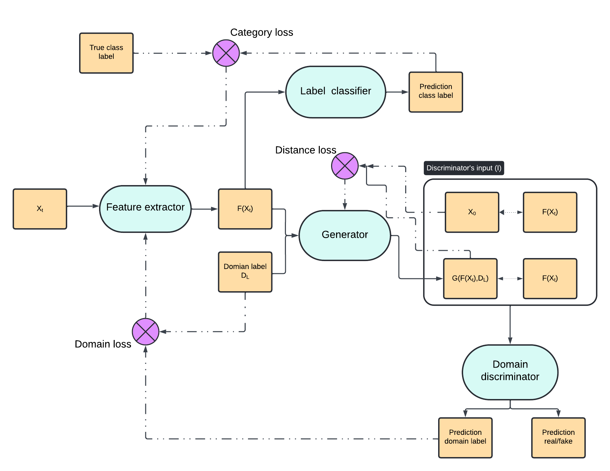

# GDAN - Generative Domain Adversarial Networks 
This repositorium presents the process of training and evaluating of the GDAN architecture. The model is designed to achieve a stable classifier resistant to performative drift and produce a mapping of new data back to the original
pre-drift distribution. The system integrates Domain Adversarial Neural Net-
works, Generative Adversarial Networks, and pixel-to-pixel translation methods,
employing necessary modifications to combine these concepts. A figure presenting the outline of the architecture is presented below. Feature extractor creates a generic, domain-invariant representation. Based on that the label classifier acts as a stable, drift-resistant classifier. The task of the generator is to create a mapping and project the data points, which have been influenced by the drift, back to their original form. 

# Setting up the environment 
The scripts were run on Oracle Grid Engine  
To setup the environment, activate a shell session, create an environment and install the requirements.txt  
>eval "$(/nethome/1177729/anaconda3/bin/conda shell.bash hook)"  
>conda create -n myenv python=3.10.11  
>conda activate myenv 
>pip install -r requirements.txt   

Later to submit a job use with your specified configuration  
>qsub -S /bin/bash Add_to_queue.sh 

# Organisation of the repositorium 
Two main scripts Perdomo_data.py and Izzo_binary_classification.py present the two types of experiments that have been performed. The scrpits/DANN_training.py is the file which defines the model and shows the entire training procedure.